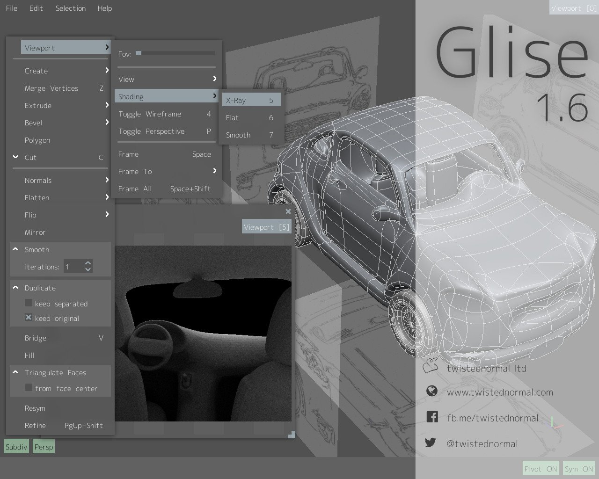
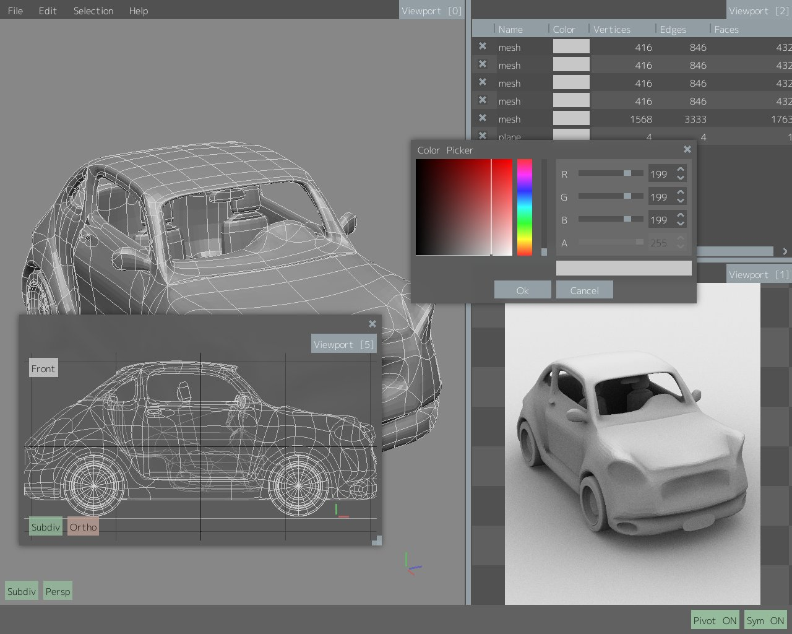
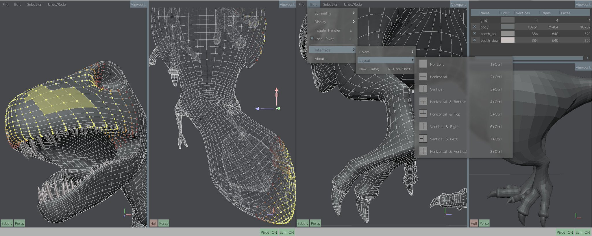
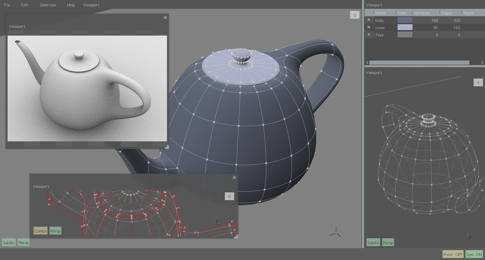
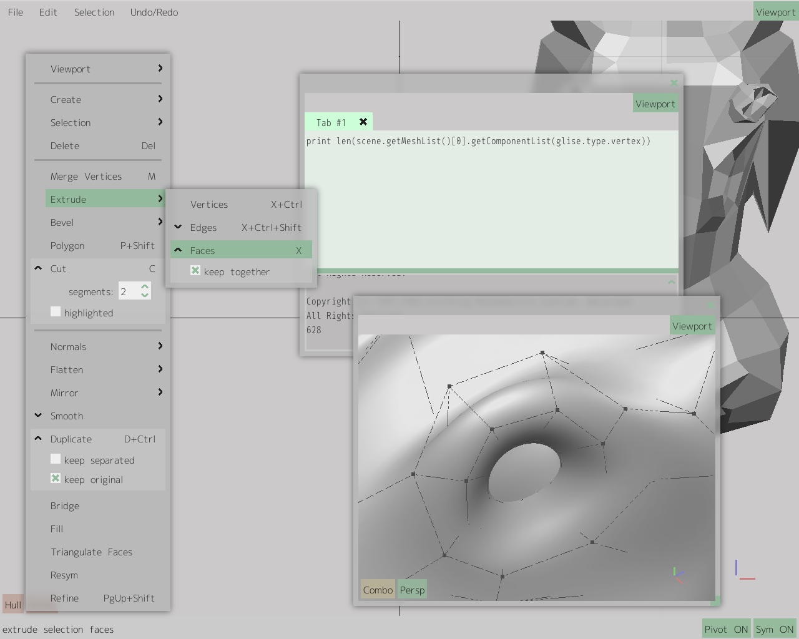
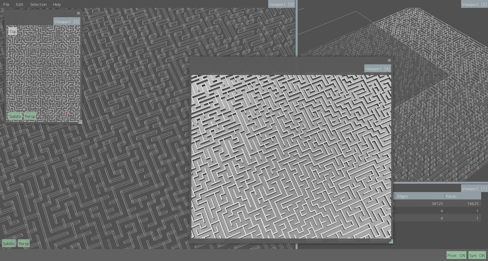
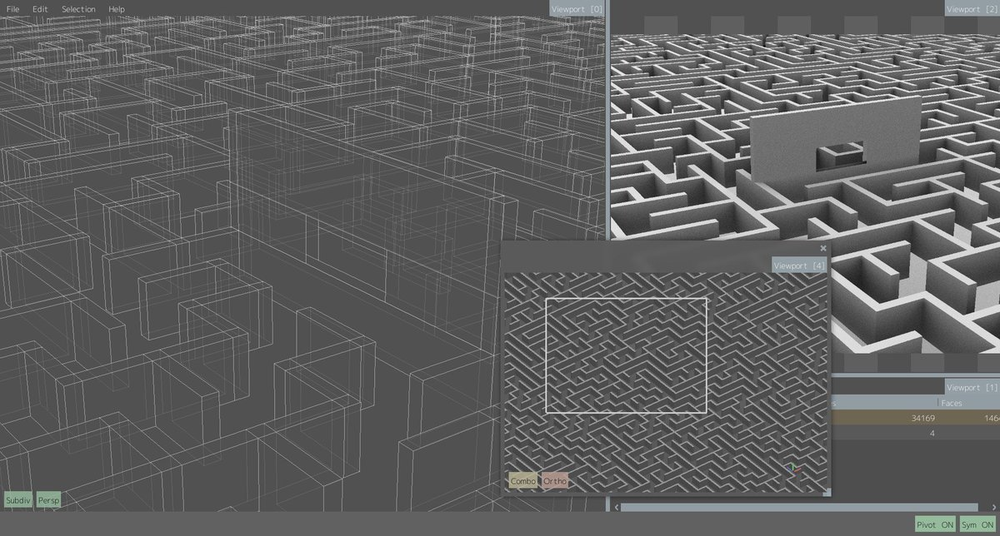

# Glise

Glise is an independent lightweight 3D modelling application developed from scratch as a personal C++/graphics/tooling project.

It includes viewport interaction, component selection/editing, subdivision-style modelling, multi-viewport UI, modelling tools, and Python-exposed APIs for procedural geometry experimentation.

## Demo

[Watch the Glise demo video](https://youtu.be/oKmjvxRnTiE?si=7B6Lnmmvks0_lyr4)

## Screenshots

## Press / publication

Glise was featured in *The MagPi* Issue 55 in the tutorial “Model a Squid with Glise”, a walkthrough introducing 3D modelling on Raspberry Pi.

The article presented Glise as a lightweight modeller built from scratch for Raspberry Pi and authored by Germano Cesari, Glise lead developer.

[The MagPi Issue 55](https://www.raspberrypi.com/magpi/issues/55)

## Notes

This repository is used as a public project overview and demo reference. Source code is not currently public.
